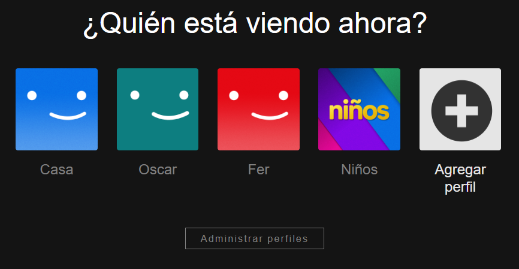

# CLON DE NETFLIX (HTML Y CSS)

[Ver este proyecto](https://sato31.github.io/coding-clonNetflix/)

Se realizó un clon de Netflix utilizando unicamente HTML y CSS.

Este proyecto se enfocó en realizar el clon de la página donde se escoge el perfil del usuario y el catálogo de películas.

Se añadió un efecto hover al pasar el mouse sobre los botones, el cual le añade un borde a la imagen y resalta el nombre del usuario.

Al pasar el mouse sobre el botón de Agregar perfil, también se sombrea el fondo.

Al hacer click en cualquier perfil se mostrará el catálogo de contenido.

Se dio libertad para realizar los carruseles de películas con las etiquetas HTML de nuestra preferencia, tratando de no utilizar código de JavaScript encontrado en la Web.

Al hacer click en algún elemento del catálogo, este se hace un poco más grande:

También se pueden observar los detalles de las esquinas redondeadas de las imágenes y las palabras sombreadas en la barra de navegación.

